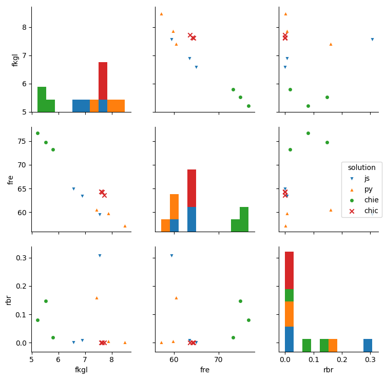

# Benchmarking procedure

* Start server `node index.js`
* Run test `./benchmark-10.sh`
* Run report `python3 report.py`

# Result

```
   b_real  b_sys  b_user    fkgl     fre  loc problem solution
0   0.246  0.022   0.236   8.390  42.035   30     gba       js
1   0.113  0.010   0.098  18.128 -28.851   15     gba       py
2   0.317  0.025   0.304   7.103  50.217   17     gba    chiml
3   0.230  0.018   0.226  11.044  22.670   16      gb       js
4   0.101  0.013   0.087  15.674 -11.228   12      gb       py
5   0.310  0.026   0.294   4.516  68.987   13      gb    chiml
6   0.221  0.021   0.214  19.039 -35.587    7       g       js
7   0.095  0.010   0.084  17.319 -23.463    6       g       py
8   0.293  0.020   0.287   4.613  68.522    6       g    chiml
```



