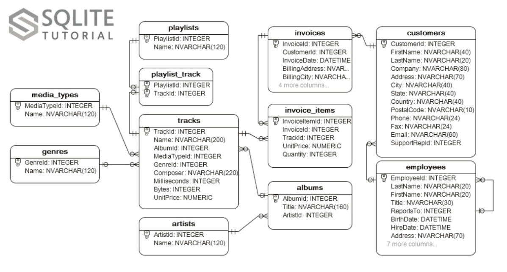

# Problem

We want to give a brief example about how `CHIML` and `Node.Js` can be use in order to orchestrate the pre-existing web-services to get data in a desired format.

We will keep the explanation as short as possible as we want the readers to state their opinions by directly looking at the implementation.

We use the database from [Chinook sample database](http://www.sqlitetutorial.net/sqlite-sample-database/). The structure of the database is as follow:



In this scenario our goal is to group `tracks` based on the `genres`. The expected data is as follow

```json
[
  {
    "GenreName": "Rock",
    "Tracks": [
      {
        "TrackName": "For Those About To Rock (We Salute You)",
        "AlbumTitle": "For Those About To Rock We Salute You"
      },
      {
        "TrackName": "Fast As a Shark",
        "AlbumTitle": "Restless and Wild"
      }
    ]
  },
  {
    "GenreName": "Latin",
    "Tracks": [
      {
        "TrackName": "Carolina",
        "AlbumTitle": "Minha Historia"
      },
      {
        "TrackName": "Essa Moça Ta Diferente",
        "AlbumTitle": "Minha Historia"
      }
    ]
  }
]
```

## Constraints

We are assuming that the only possible way to get the data is by accessing the pre-existing `web service` using HTTP.

## Web Service

Once the web-server has been started, the developer can send a GET request to `http://<server>:<port>/<tableName>?<fieldName>=<value>`  to the server.

__Example:__

```
URL: http://localhost:3010/genres?Name=Rock
RESULT: [{"GenreId":1,"Name":"Rock"}]
```

# Solution I: CHIML

CHIML is a YAML based language designed to orchestrate process flow in [Chimera-Framework]()

The detail explanation about CHIML language specification can be found [here](https://github.com/goFrendiAsgard/chimera-framework/wiki/CHIML)

There are 2 ways to develop the solutions. In the first implementation, we try to access terminal-interface, while in the second implementation we try to access web service

## Implementation

```
# filename: chimera.web.chiml
# usage: chimera chimera.web.chiml
out: genres
do:

  - parallel:
    - |('http://localhost:3010/genres') --> urlGenre
    - |('http://localhost:3010/albums') --> urlAlbum
    - |('http://localhost:3010/tracks') --> urlTrack

  - |(urlGenre) -> [$.httpRequest] -> response
  - |(response.body) --> genres

  - map: genres
    into: genres
    ins: genre
    out: genre
    do:

      - parallel:
        - do:
          - |(urlTrack + '?GenreId=' + genre.GenreId) -> [$.httpRequest] -> response
          - |(response.body) --> tracks
        - |({GenreName: genre.Name, Tracks: []}) --> genre

      - map: tracks
        into: tracks
        ins: track
        out: track
        do:

          - |(urlAlbum + '?AlbumId=' + track.AlbumId) -> [$.httpRequest] -> response
          - |(response.body) --> albums
          - |(albums[0].Title) --> albumTitle

          - |({TrackName: track.Name, AlbumTitle: albumTitle}) --> track

      - |(tracks) -->  genre.Tracks

```

## Performance (5 records for each tables)
```
real    0m0.530s
user    0m0.526s
sys     0m0.059s
```

## Performance (10 records for each tables)
```
real    0m1.014s
user    0m1.042s
sys     0m0.091s
```

## Performance (15 records for each tables)
```
real    0m1.010s
user    0m1.032s
sys     0m0.092s
```

## Solution II: HTTP API

HTTP API is currently gain it popularity. Almost everything on the internet has HTTP-API interface, either by using `SOAP`, `REST`, or non-standardized protocol.

As already implied, HTTP API is only communicating through web-service. We are currently build the solution in Node.Js. Since Node.Js has asynchronous 

## Implementation

```js
// filename: api.web.js
// usage: node api.web.js
const request = require('request')
const async = require('async')
const urlGenre = 'http://localhost:3010/genres'
const urlAlbum = 'http://localhost:3010/albums'
const urlTrack = 'http://localhost:3010/tracks'

let finalResult = []
request(urlGenre, (error, response, body) => {
  if (error) {
    return console.error(error)
  }

  let genres = JSON.parse(body)
  let fetchTracks = []

  for (let i = 0; i < genres.length; i++) {
    let genre = genres[i]

    finalResult.push({GenreName: genre.Name, tracks: []})
    genre.tracks = []

    fetchTracks.push((nextFetchTrack) => {
      request(urlTrack + '?GenreId=' + genre.GenreId, (error, response, body) => {
        if (error) {
          return nextFetchTrack(error)
        }

        let tracks = JSON.parse(body)
        let fetchAlbum = []

        for (let j = 0; j < tracks.length; j++) {
          let track = tracks[j]
          finalResult[i]['tracks'].push({TrackName: track.Name})

          fetchAlbum.push((nextFetchAlbum) => {
            request(urlAlbum + '?AlbumId=' + track.AlbumId, (error, response, body) => {
              if (error) {
                return nextFetchAlbum(error)
              }

              let albums = JSON.parse(body)
              let album = albums[0]
              finalResult[i]['tracks'][j]['AlbumTitle'] = album.Title
              nextFetchAlbum()
            })
          })
        }

        return async.parallel(fetchAlbum, (error, result) => {
          nextFetchTrack(error, result)
        })
      })
    })
  }

  return async.parallel(fetchTracks, (error, result) => {
    if (error) {
      return console.error(error)
    }
    return console.log(JSON.stringify(finalResult))
  })
}
```

### Performance (5 records for each tables)

```
real    0m0.286s
user    0m0.248s
sys     0m0.029s
```

### Performance (10 records for each tables)

```
real    0m0.369s
user    0m0.314s
sys     0m0.044s
```

### Performance (15 records for each tables)

```
real    0m0.358s
user    0m0.319s
sys     0m0.055s
```

# Your Opinion

After seeing the problem and the alternative solutions, please fill up the questionaires.

For each solutions, you have to answer these questions:

* How familiar are you with the solution
  - I can't follow the example and I never heard about it before
  - I can't follow the example but I have heard about it before
  - I understand the example eventhough I never heard about it before
  - I understand the example and I'm already familiar with the solution

* In the scale of 1-5 how readable is the solution (in case of you can provide the better implementation compared to ours, you can judge this question by using your own implementation)
  - 1
  - 2
  - 3
  - 4
  - 5

* In the scale of 1-5 how likely will you use the solution in your next serious project
  - 1
  - 2
  - 3
  - 4
  - 5

* In the scale of 1-5 how likely will you use the solution in your next hobby project
  - 1
  - 2
  - 3
  - 4
  - 5
